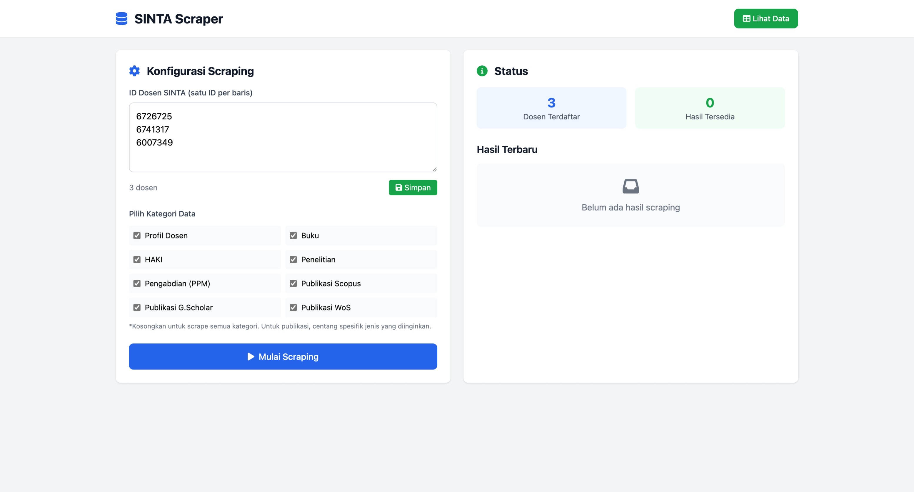
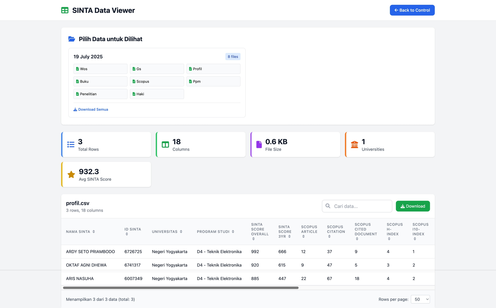

# SINTA Scraping Web

Aplikasi web sederhana untuk mengambil data dari platform SINTA (Science and Technology Index) dengan mudah. Dilengkapi interface yang user-friendly untuk scraping data dosen dan publikasi akademik.

## ✨ Fitur Utama

- **🎯 Interface Web Sederhana**: Mudah digunakan untuk input data dan monitoring scraping
- **📊 Multi-Category Scraping**: Mendukung berbagai kategori data:
  - 📖 Publikasi (Scopus, Web of Science, Google Scholar)
  - 🔬 Penelitian
  - 📚 Buku
  - ⚖️ HAKI (Hak Kekayaan Intelektual)
  - 🤝 Pengabdian kepada Masyarakat
  - 👤 Profil Dosen
- **💾 Export CSV**: Hasil otomatis tersimpan dalam format CSV
- **� Output Terorganisir**: File tersimpan dalam folder berdasarkan tanggal

## 🖼️ Tampilan Aplikasi

### Halaman Scraping

*Interface untuk memulai proses scraping data*

### Halaman Viewer

*Tampilan hasil scraping dan download file*

## �️ Instalasi

### 1. Download atau Clone
```bash
git clone https://github.com/yourusername/sinta-scraping-web.git
cd sinta-scraping-web
```

### 2. Install Dependencies
```bash
pip install flask beautifulsoup4 requests python-dotenv
```

### 3. Edit Kredensial
Ubah `.env.example` menjadi `.env`dan isi:
```
SINTA_USERNAME=your_email@example.com
SINTA_PASSWORD=your_password
```

### 4. Siapkan File Dosen
Buat file `dosen.txt` dengan format:
```
Nama Dosen 1
Nama Dosen 2
Nama Dosen 3
```

## � Cara Penggunaan

### 1. Jalankan Aplikasi
```bash
python sinta-web.py
```

### 2. Buka Browser
- Kunjungi: **http://localhost:5000**
- Interface web akan terbuka otomatis

### 3. Upload File Dosen
- Edit `dosen.txt`manual atau
- Isi pada halaman web ID Sinta baris per baris
> contoh: https://sinta.kemdikbud.go.id/authors/profile/6726725

### 4. Pilih Kategori Data
- ✅ Centang kategori yang ingin di-scrape
- Bisa pilih satu atau beberapa sekaligus

### 5. Mulai Scraping
- Klik tombol **"Start Scraping"**
- Tunggu proses selesai (akan ada notifikasi)

### 6. Download Hasil
- File CSV tersedia di folder `output-[tanggal]`
- Download langsung melalui web interface

## 📁 Hasil Output

Setelah scraping selesai, Anda akan mendapat folder seperti ini:

```
output-19072025/
├── profil.csv           # Data profil dosen
├── publikasi_scopus.csv # Publikasi Scopus
├── publikasi_wos.csv    # Publikasi Web of Science
├── publikasi_gs.csv     # Publikasi Google Scholar
├── penelitian.csv       # Data penelitian
├── ppm.csv             # Pengabdian masyarakat
├── buku.csv            # Data buku
└── haki.csv            # Data HAKI
```

## 💡 Tips Penggunaan

- **Mulai dengan File Kecil**: Test dulu dengan 2-3 nama dosen
- **Pilih Kategori Sesuai Kebutuhan**: Tidak harus scrape semua kategori
- **Bersabar**: Proses scraping membutuhkan waktu tergantung jumlah data
- **Periksa Koneksi Internet**: Pastikan koneksi stabil selama proses

## 🔧 Troubleshooting

**Q: Aplikasi tidak bisa diakses di browser?**
A: Pastikan tidak ada aplikasi lain yang menggunakan port 5000

**Q: Error saat scraping?**
A: Cek koneksi internet dan pastikan nama dosen ditulis dengan benar

**Q: File CSV kosong?**
A: Kemungkinan dosen tidak ditemukan di SINTA atau tidak ada publikasi

**Q: Proses scraping terlalu lama?**
A: Normal jika data banyak. Bisa dicoba dengan jumlah dosen yang lebih sedikit

## � Lisensi

Proyek ini menggunakan MIT License - lihat file [LICENSE](LICENSE) untuk detail.

---

**Disclaimer**: Aplikasi ini untuk tujuan penelitian dan edukasi. Patuhi terms of service SINTA.